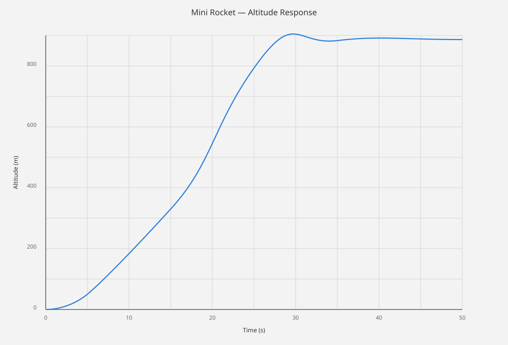
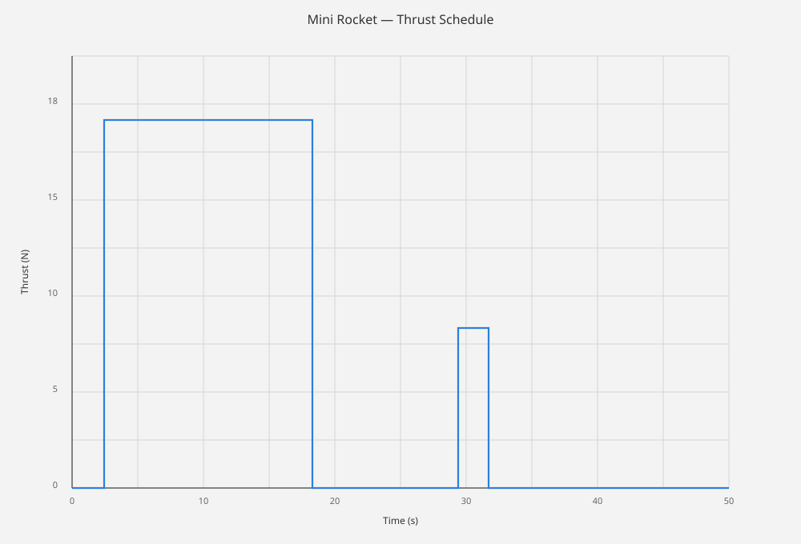
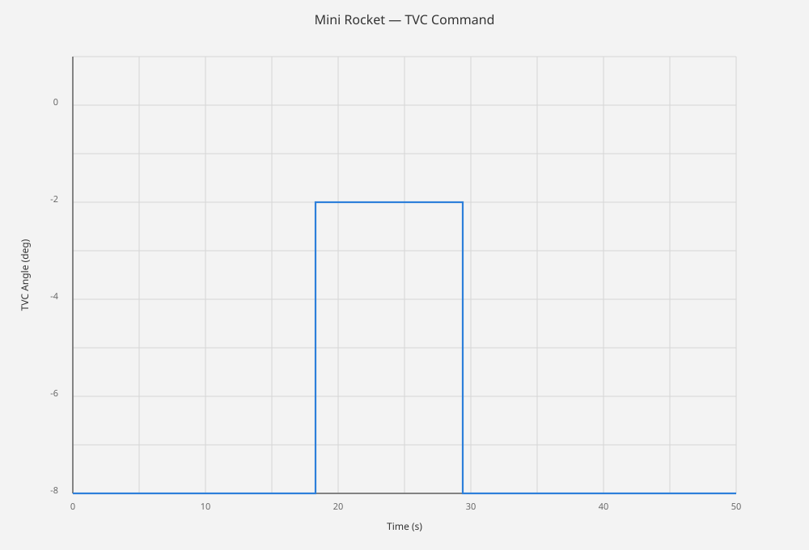
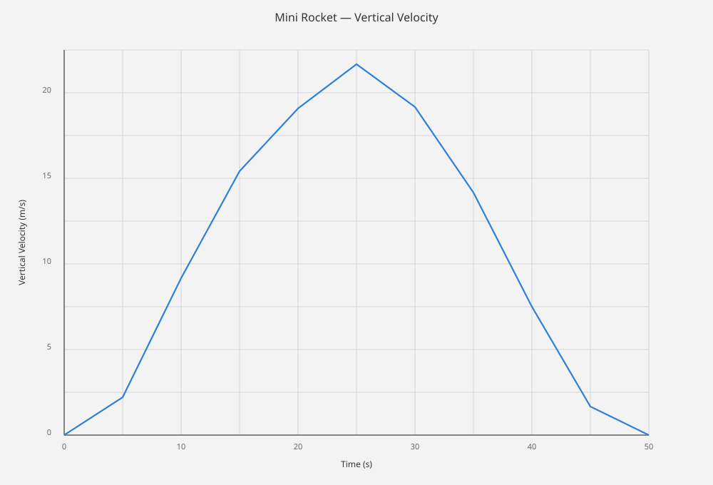

# Mini Rocket — TVC & Recovery Simulation

A conceptual MATLAB simulation exploring thrust-vector control, attitude response, vertical motion, recovery logic, and trajectory behavior for a small rocket model.

## Project Overview

This project demonstrates a simplified aerospace GNC workflow using MATLAB. The model includes translational motion, pitch attitude, angular velocity, thrust-vector-control deflection, mass depletion, and recovery behavior.

## Main File

Run:

```matlab
rocket
```

The script generates altitude, thrust, TVC, vertical velocity, trajectory, and pitch-response plots.

## Simulation Output Figures

### Altitude response



### Thrust schedule


### TVC command



### Vertical velocity



### 3D recovery trajectory



## State Vector

```text
[x z vx vz theta q delta mass]
```

- `x` — horizontal position
- `z` — altitude
- `vx` — horizontal velocity
- `vz` — vertical velocity
- `theta` — pitch angle
- `q` — pitch angular velocity
- `delta` — TVC deflection
- `mass` — vehicle mass

## Control

The simplified controller contains altitude/vertical-velocity feedback, pitch and angular-rate feedback, TVC actuator dynamics, and TVC saturation.

## Numerical Model

The simulation uses a fixed-step numerical integration scheme and a reduced-order rigid-body model.

## Outputs

1. Altitude history
2. Thrust profile
3. TVC angle
4. Vertical velocity
5. Trajectory
6. Pitch response

## Repository Structure

```text
Mini-Rocket-TVC-Recovery/
├── rocket.m
├── README.md
├── .gitignore
└── figures/
    ├── mini_rocket_altitude.svg
    ├── mini_rocket_thrust_schedule.svg
    ├── mini_rocket_tvc_command.svg
    ├── mini_rocket_vertical_velocity.svg
    └── mini_rocket_3d_recovery_path.svg
```

## Engineering Topics

- Aerospace dynamics
- GNC
- TVC
- Feedback control
- Numerical integration
- Attitude dynamics
- Trajectory simulation
- MATLAB visualization

## Limitations

This is a reduced-order educational simulation.

## Safety / Scope

This repository is intended for simulation and academic study.

## Author

**Sewon Zion S.**

Aeronautical Engineering

Focus areas: Aerospace GNC, Rocket Propulsion, Flight Dynamics, Simulation, and Control Systems.
